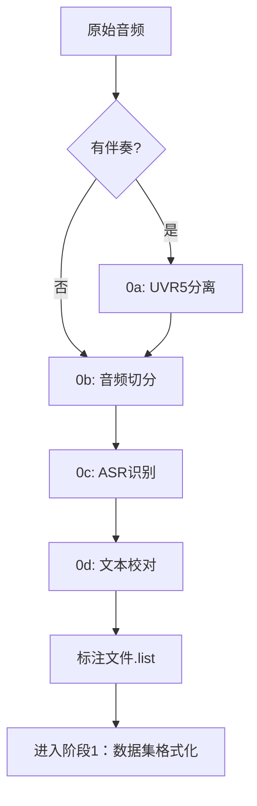

# GPT-SoVITS 数据准备模块

## 📋 概述

本模块提供 GPT-SoVITS 阶段0的数据准备功能，将原始音频数据转换为可用于训练的标注数据。

---

## 🔄 阶段0：前置数据集获取工具

### 步骤0a：人声分离（可选）
- **工具**：UVR5 人声伴奏分离
- **输入**：带伴奏的音频文件
- **输出**：纯人声 `.wav` 文件
- **适用场景**：原始音频包含背景音乐、混响、伴奏时使用

### 步骤0b：音频切分（必需）
- **工具**：智能音频切分
- **输入**：长音频文件（>30秒）
- **输出**：2-15秒的短片段 `.wav` 文件
- **命名规则**：`原文件名_起始帧数_结束帧数.wav`

### 步骤0c：语音识别（必需）
- **工具**：ASR 自动语音识别
- **输入**：切分后的音频片段
- **输出**：`.list` 标注文件
- **格式**：`音频路径|说话人|语言|文本内容`

### 步骤0d：文本校对标注（可选）
- **工具**：手动校对工具
- **输入**：ASR生成的标注文件
- **输出**：校对后的标注文件
- **功能**：文本编辑、音频分割合并、删除无效数据

---

## 🏗️ 模块结构

```
DataPreparation/
├── README.md                    # 本文档
├── voice_separation/            # 🚧 步骤0a：人声分离（计划中）
├── audio_slice/                 # ✅ 步骤0b：音频切分
├── asr_recognition/             # ✅ 步骤0c：ASR识别
└── text_annotation/             # 🚧 步骤0d：文本校对（计划中）
```

---

## 📂 输出数据流



---

## 🎯 使用流程

1. **准备原始音频**：收集需要训练的音频文件
2. **人声分离**（可选）：如果音频有伴奏，使用UVR5分离
3. **音频切分**：将长音频切分成短片段
4. **语音识别**：使用ASR生成初始标注
5. **文本校对**（推荐）：手动校对提高标注质量
6. **输出标注文件**：生成`.list`格式的训练标注

---

*当前实现进度：2/4 模块完成（audio_slice, asr_recognition）*