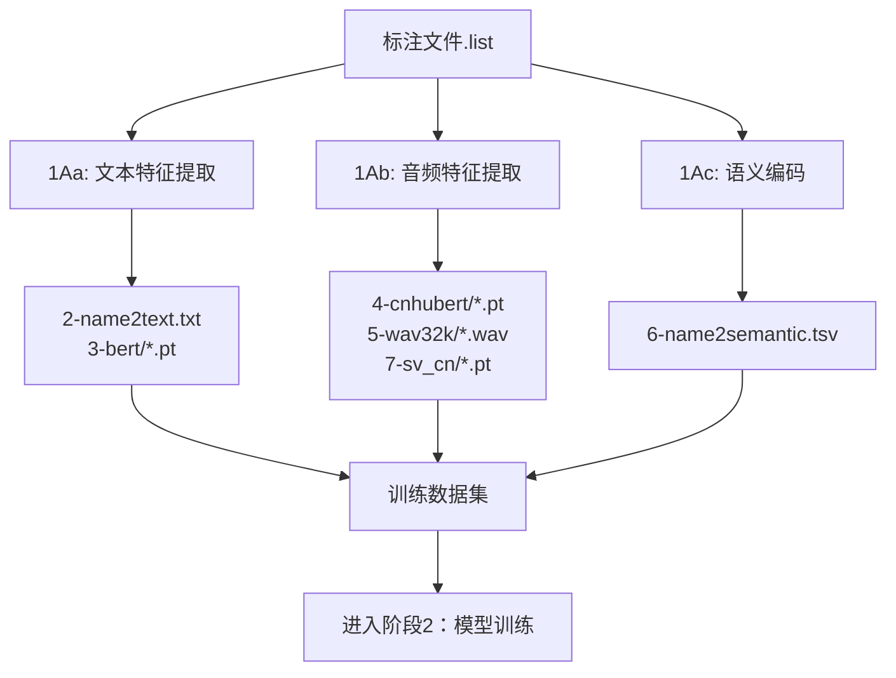

# GPT-SoVITS 数据集格式化模块

## 📋 概述

本模块提供 GPT-SoVITS 阶段1的数据集格式化功能，将标注数据转换为模型训练所需的特征表示。

---

## 🔄 阶段1：训练集格式化工具

### 步骤1Aa：文本特征提取
- **工具**：BERT + 音素转换
- **输入**：`.list` 标注文件 + 音频目录
- **输出**：
  - `2-name2text.txt` - 音素序列文件
  - `3-bert/*.pt` - BERT特征张量（1024维）

### 步骤1Ab：音频特征提取
- **工具**：CNHubert SSL + 重采样 + 说话人特征
- **输入**：原始音频文件
- **输出**：
  - `4-cnhubert/*.pt` - CNHubert SSL特征（768维）
  - `5-wav32k/*.wav` - 32kHz重采样音频
  - `7-sv_cn/*.pt` - 说话人特征（v2Pro版本，20480维）
- **功能**：多版本兼容、多进程并行、智能配置、错误恢复

### 步骤1Ac：语义编码
- **工具**：预训练SoVITS-G编码器
- **输入**：CNHubert特征文件
- **输出**：`6-name2semantic.tsv` - 语义Token序列
- **功能**：多版本自动检测、并行处理、智能配置

---

## 🏗️ 模块结构

```
DatasetFormatting/
├── README.md                    # 本文档
├── text_processing/             # ✅ 步骤1Aa：文本特征提取
├── audio_features/              # ✅ 步骤1Ab：音频特征提取
└── semantic_encoding/           # ✅ 步骤1Ac：语义编码
```

---

## 📂 输出数据流



---

## 🎯 使用流程

1. **输入标注文件**：来自阶段0的`.list`文件
2. **文本特征提取**：音素转换 + BERT特征
3. **音频特征提取**：CNHubert SSL + 重采样 + 说话人特征
4. **语义编码**：语义Token提取
5. **数据验证**：检查所有特征文件完整性
6. **输出训练集**：可直接用于模型训练的数据

---

*当前实现进度：3/3 模块完成（text_processing, audio_features, semantic_encoding）*