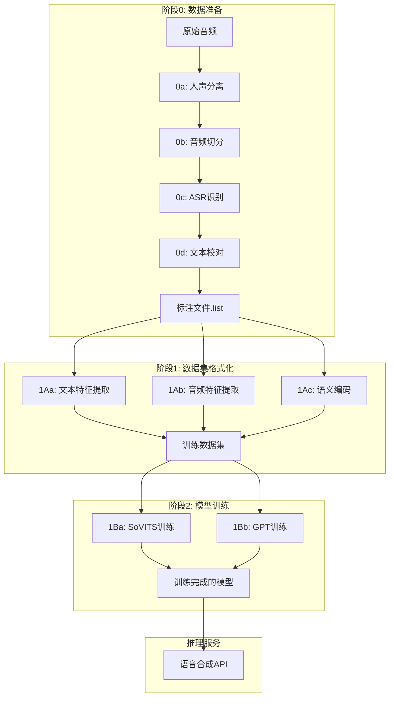

# GPT-SoVITS FastAPI 服务模块

## 📋 概述

本目录提供 GPT-SoVITS 完整流程的 FastAPI 服务化实现，按照官方流程划分为三个主要阶段。

---

## 🏗️ 目录结构

```
FastApi/Base/
├── README.md                    # 本文档
├── DataPreparation/             # 阶段0：前置数据集获取工具
│   ├── voice_separation/        # 0a: UVR5人声分离（计划中）
│   ├── audio_slice/             # 0b: 音频切分 ✅
│   ├── asr_recognition/         # 0c: ASR识别 ✅
│   └── text_annotation/         # 0d: 文本校对标注（计划中）
├── DatasetFormatting/           # 阶段1：训练集格式化工具
│   ├── text_processing/         # 1Aa: 文本特征提取 ✅
│   ├── audio_features/          # 1Ab: 音频特征提取 ✅
│   └── semantic_encoding/       # 1Ac: 语义编码 ✅
├── Training/                    # 阶段2：微调训练
│   ├── sovits_training/         # 1Ba: SoVITS训练（计划中）
│   └── gpt_training/            # 1Bb: GPT训练（计划中）
└── Inference/                   # 推理服务 ✅
    ├── service.py                   # 核心推理API
    ├── model_manager.py         # 模型管理器
    ├── audio_processor.py       # 音频处理器
    ├── server.py               # FastAPI服务器
    ├── utils.py                # 工具函数
    ├── test.py                 # 测试脚本
    ├── example.py              # 使用示例
    ├── run_server.py           # 服务启动脚本
    └── README.md               # 推理服务说明
```

---

## 🔄 完整流程

### 阶段0：数据准备 → 阶段1：格式化 → 阶段2：训练



---

## 🎯 各阶段功能

### 📁 **DataPreparation（数据准备）**
将原始音频转换为标注数据：
- **输入**：原始音频文件
- **输出**：`.list` 格式的标注文件
- **功能**：人声分离、音频切分、语音识别、文本校对

### 📁 **DatasetFormatting（数据集格式化）**
将标注数据转换为训练特征：
- **输入**：`.list` 标注文件
- **输出**：训练所需的特征文件
- **功能**：文本特征、音频特征、语义编码

### 📁 **Training（模型训练）**
训练GPT-SoVITS模型：
- **输入**：格式化的训练数据
- **输出**：训练完成的模型权重
- **功能**：SoVITS训练、GPT训练

### 📁 **Inference（推理服务）**
提供语音合成服务：
- **输入**：文本 + 参考音频
- **输出**：合成的语音
- **功能**：实时语音合成API

---

## 🚀 快速开始

### 🌟 **推荐方式：统一网关 (单端口)**
```bash
# 启动统一网关服务 (推荐)
python run_unified_gateway.py --port 8000

# 访问统一API文档
open http://localhost:8000/docs

# 一键完整工作流
curl -X POST "http://localhost:8000/workflow/complete" \
  -F "project_name=my_voice" \
  -F "input_audio_dir=/path/to/audio" \
  -F "output_dir=/path/to/output"
```

### 📋 **传统方式：独立服务 (多端口)**

#### 1. 数据准备阶段
```bash
# 音频切分
cd DataPreparation/audio_slice
python run_server.py --port 8001

# ASR识别
cd DataPreparation/asr_recognition  
python run_server.py --port 8002
```

#### 2. 数据集格式化阶段
```bash
# 文本特征提取
cd DatasetFormatting/text_processing
python run_server.py --port 8003

# 音频特征提取
cd DatasetFormatting/audio_features
python run_server.py --port 8004

# 语义编码
cd DatasetFormatting/semantic_encoding
python run_server.py --port 8005
```

#### 3. 模型训练阶段
```bash
# GPT训练
cd Training/gpt_training
python run_server.py --port 8007

# SoVITS训练
cd Training/sovits_training
python run_server.py --port 8006

# 统一训练服务
cd Training
python unified_server.py --port 8008
```

#### 4. 推理服务
```bash
# 推理服务
cd Inference/
python run_server.py --port 8009
```

---

## 📊 实现进度

### ✅ 已完成模块（9/9）
- **DataPreparation/audio_slice** - 音频切分
- **DataPreparation/asr_recognition** - ASR识别  
- **DatasetFormatting/text_processing** - 文本特征提取
- **DatasetFormatting/audio_features** - 音频特征提取（CNHubert SSL + 32kHz重采样 + 说话人特征）
- **DatasetFormatting/semantic_encoding** - 语义编码（语义Token提取）✅
- **Training/gpt_training** - GPT模型训练 ✅
- **Training/sovits_training** - SoVITS模型训练 ✅
- **Training/unified_server** - 统一训练服务 ✅
- **Inference** - 语音合成推理服务 ✅

### 🚧 计划中模块（0/9）
- **DataPreparation/voice_separation** - 人声分离（可选）
- **DataPreparation/text_annotation** - 文本校对（可选）

---

## 🔧 开发指南

### 🌟 **统一网关架构**
推荐使用统一网关模式，将所有服务整合到单个端口：

```
🌐 统一网关 (端口: 8000)
├── /data-prep/*      # 数据准备服务
├── /dataset/*        # 数据格式化服务  
├── /training/*       # 训练服务
├── /inference/*      # 推理服务
├── /workflow/*       # 完整工作流
└── /batch/*          # 批量处理
```

**优势**:
- ✅ 单端口访问，无需记住多个端口
- ✅ 统一认证和权限管理
- ✅ 一键完整工作流执行
- ✅ 集中式监控和日志
- ✅ 简化部署和运维

详见: [统一网关文档](UNIFIED_GATEWAY.md)

### API设计原则
1. **统一接口**：所有模块提供相同的API结构
2. **异步支持**：支持异步处理和批量操作
3. **错误处理**：完善的错误处理和状态反馈
4. **配置智能**：根据数据特征自动优化参数

### 模块结构规范
```
module_name/
├── __init__.py          # 模块初始化
├── service.py               # 核心API类
├── server.py            # FastAPI服务（可选）
├── utils.py             # 工具函数
├── test.py              # 测试脚本
├── example.py           # 使用示例
└── run_server.py        # 服务启动（可选）
```

---

## 📝 贡献指南

1. **新增模块**：按照规范结构创建
2. **API兼容**：保持与GPT-SoVITS官方格式兼容
3. **文档完善**：提供详细的使用说明和示例
4. **测试覆盖**：编写完整的测试用例

---

*最后更新：2024年 - 当前总体进度：9/9 模块完成 🎉*